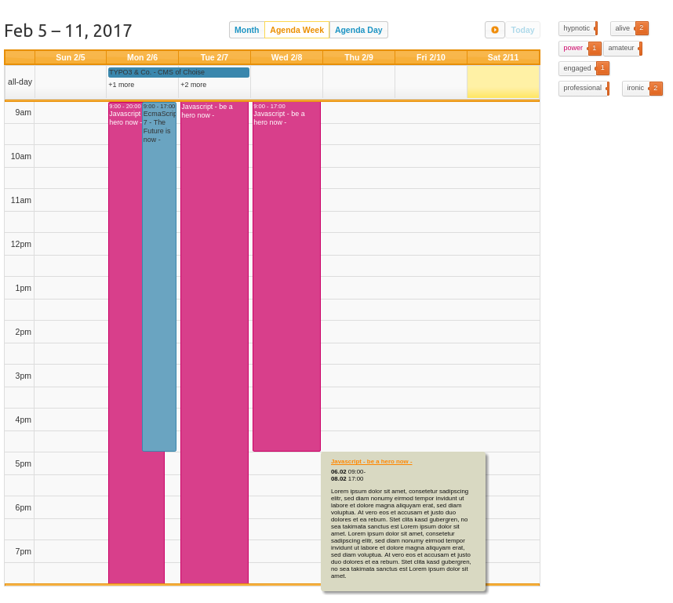
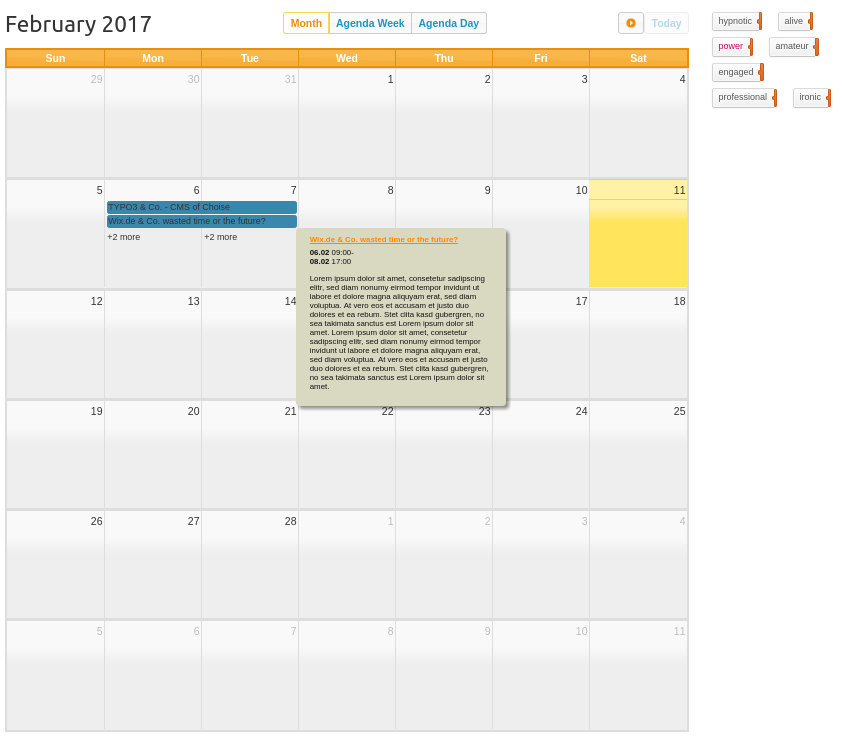
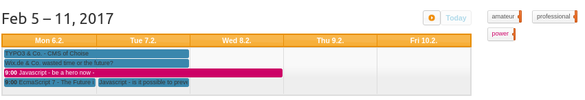
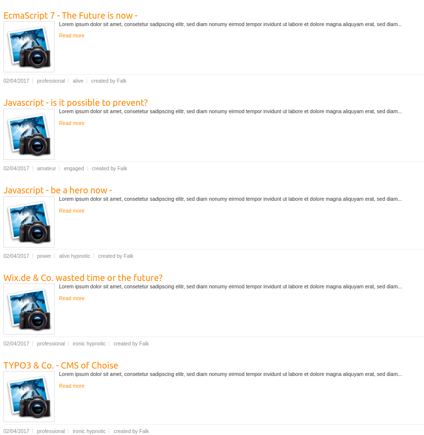
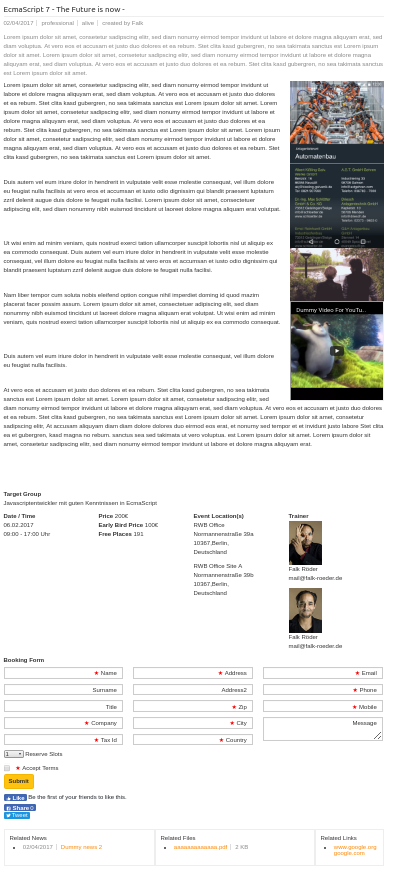

.. ==================================================
.. FOR YOUR INFORMATION
.. --------------------------------------------------
.. -*- coding: utf-8 -*- with BOM.

.. include:: ../Includes.txt

.. _introduction:

.. _what-it-does:

What does it do?
===================

This extensions extends the extension tx_news with some functionality:
- extending the news record with some options so records can be used as events
- Adds a wideley configurable calendarview based on http://fullcalendar.io and http://qtip2.com
- Events can be filtered in calendar view
- it does not destroy the functionality of tx_news extension, it still can also be used as blog or something
- Adds the possibility to applicate / book for events with confirmation link, file send, ICS invitations and of course, email notifications

.. _screenshots:

Screenshots
-----------

This chapter should help people figure how the extension works. Remove it
if not relevant.

   Shows example of the Agenda Week View with all day slot and tags-category filter, switchable view buttons on the top and the quicktip which is shown by hovering

   Shows example of the Month View with tags-category filter, switchable view buttons on the top and the quicktip which is shown by hovering

   Shows example of the Basic Week View with tags-category filter.

   Shows example of the Standard news List view.

   Shows example of the Detail View with booking form and Event Details.

